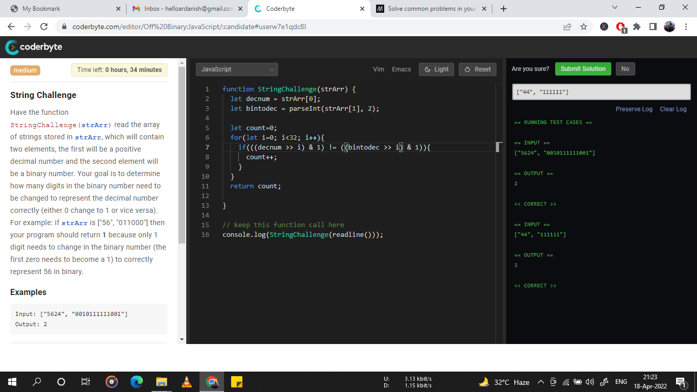

# CodeByte

## Problem - String Challenge


Have the function:

StringChallenge (strArr) read the array of strings stored in strArr, which will contain two elements,
the first will be a positive decimal number. Your goal is to determine how many digits in the binary
number need to be changed to represent the decimal number correctly(either 0 change to 1 or vice-versa).
For example : if strArr is ["56", "011000"] then your program should return 1 because only 1 digit needs
to change the binary number(the first zero needs to become a 1) to correctly represent 56 in binary.


Examples:

Input : ["5624", "0010111111001"]
Output : 2


Input : ["44", "111111"]
Output : 3


*Instruction : problem should be solved in javaScript only*


```js

function StringChallenge(strArr){
  // code goes here
  
  return strArr;
}

//keep this function call here
console.log(StringChallenge(readline()))

```


### Solution

```js

// solved using binary operation approach of shifitng numbers


function StringChallenge(strArr){
  // code goes here
  let decnum = strArr[0];
  let bintodec = parseInt(strArr[1],2);
  
  let count = 0;
  for (let i=0; i < 32; i++){
    if(((decnum >> i) & 1) != ((bintodec >> i) & 1)){
      count ++;
    }
  }
  
  return count;
}

//keep this function call here
console.log(StringChallenge(readline()))

```

#### That's it! I passed all the cases!

### Happy Coding, A R
