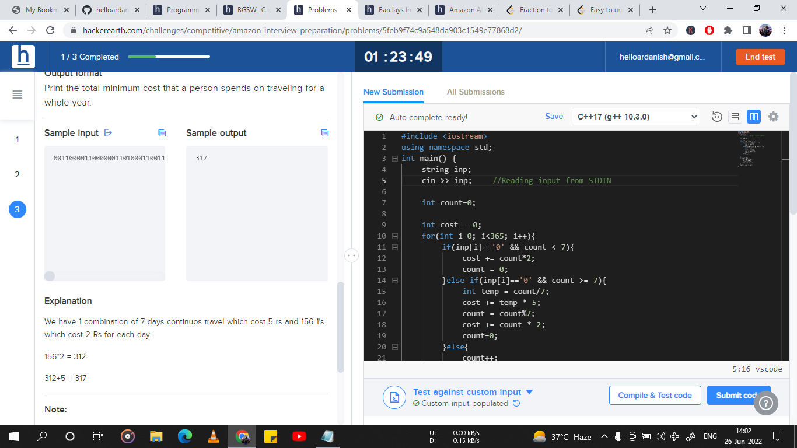

# Problem
# TravellingExpenses




## Solution

```cpp

#include <iostream>
using namespace std;
int main() {
	string inp;
	cin >> inp;    //Reading input from STDIN

	int count=0;

	int cost = 0;
	for(int i=0; i<365; i++){
		if(inp[i]=='0' && count < 7){
			cost += count*2;
			count = 0;
		}else if(inp[i]=='0' && count >= 7){
			int temp = count/7;
			cost += temp * 5;
			count = count%7;
			cost += count * 2;
			count=0;
		}else{
			count++;
		}
	}
	if(count!=0){
		int temp = count/7;
		cost += temp*5;
		count = count%7;
		cost += count * 2;
	}
	cout << cost << endl;
}

```


## Happy Coding
# A R
