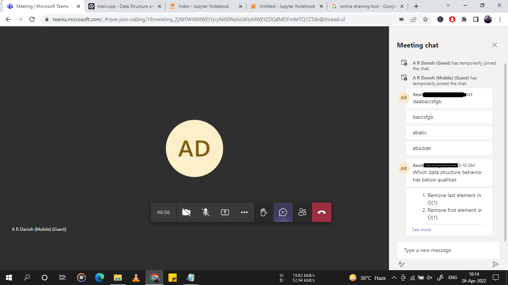

# Longest subsequence

Given a string **s** you have to return the longest sequence of a substring of the same character.

Example:

## Input : daabaccsfgb
## Output : baccsfgb

Explanation : Longest substring is of b of length 8 so return that substring.

Edge case : If some substring are of same length, print all the substring of same length.

Example 2:

## Input : ababc
## Output : aba, bab

Because longest substring of a is aba and of b is bab. Both are the same in length so return both of them.


## Python solution


```python


#mystr  = "daabaccsfgb";
#mystr  = "ababc";

mystr = input()
start=0
ansarr = []

maxdiff = 0
for i in range(len(mystr)):
    firstch = mystr[i]
    end=len(mystr)-1
    while(end>i):
        lastchr = mystr[end]
        if(firstch==lastchr):
            temp = end-start;
            if(temp > maxdiff):
                maxdiff = temp
                if(len(ansarr)>0):
                    ansarr.pop()
                ansarr.append(mystr[start:end+1]);
            elif temp==maxdiff:
                ansarr.append(mystr[start:end+1]);
            break;
        end-=1
    start+=1
   
for x in ansarr:
  print(x)


```


## c++ solution

```cpp


#include <iostream>
#include <vector>
#include <string>

using namespace std;
vector<string> returnlongestsubsequence(string mystr){
  int start = 0;
  vector<string> myarr;
  int maxdiff = 0;
  for(int i=0; i< mystr.length(); i++){
    char firstch = mystr[i];
    int end = mystr.length()-1;
    while(end>i){
      char lastch = mystr[end];
      if(firstch == lastch){
        int temp = end-start;
        if(temp>maxdiff){
          maxdiff = temp;
          if(!myarr.empty()) myarr.pop_back();
          string tempstr = "";
          /*
          for(int j=start; j<end+1; j++){
            tempstr+=mystr[j];
          }
          */
          //one liner
          tempstr+=mystr.substr(start,end+1);
          myarr.push_back(tempstr);
        }else if (temp==maxdiff){
          string tempstr = "";
          
          for(int j=start; j<end+1; j++){
            tempstr+=mystr[j];
          }
          
          //tempstr+=mystr.substr(start,end+1);
          myarr.push_back(tempstr);
        }
        break;
      }
      --end;
    }
    ++start;
  }
  return myarr;
}


int main(){
  string inpstr;
  //cin >> inpstr;
  //inpstr = "daabaccsfgb";
  inpstr = "ababc";
  
  vector<string> ansarr = returnlongestsubsequence(inpstr);
  for(auto x: ansarr) cout << x << endl;
  
  return 0;
}


```

### We can use hashmap to check if a character length has already been checked or checked.
unordered_map(ch) = true or false. This way we don't have to check again the same character but it'll take extra space.


Complexity is **O(n^2)** which isn't good, so we must think of minimizing it, but that's another story.
Since constraints will not be high it doesn't matter in interview. When implementing in actual code we must think of minimizing it.


### I was having hard time when writing code in C++(still improving), so I requested and started coding in python.
### Python is always a best friend ;)

## Happy Coding,
# A R
