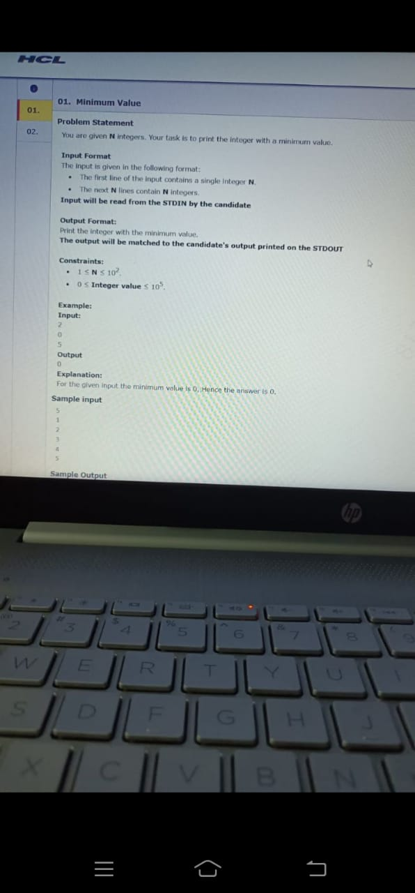

# HCL

## Problem - Minimum value in list


```python
nol = int(input())
my_arr = [];
for i in range(nol):
    temp = int(input())
    my_arr.append(temp)
print(min(my_arr))
```

## Happy Coding, A R
